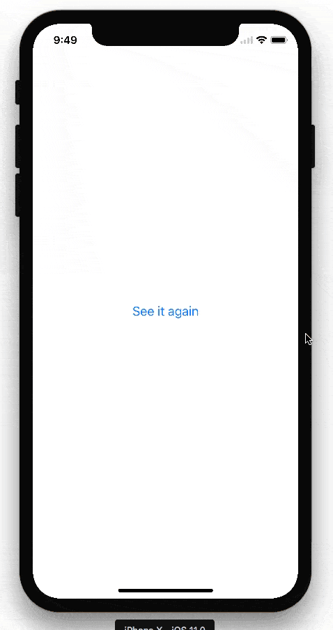

# react-native-mask-loader

This component provides a loading screen for React Native apps that is meant to reproduce Twitter's app loading animation.

There is an accompanying blog post at https://facebook.github.io/react-native/blog/2018/01/18/implementing-twitters-app-loading-animation-in-react-native.html.



## Installation

```
yarn add react-native-mask-loader

# or npm install react-native-mask-loader
```

## Usage

```
import Loader from 'react-native-mask-loader';

<Loader
  isLoaded={this.state.appHasLoaded}
  imageSource={require('./assets/twitter.png')}
  backgroundStyle={styles.loadingBackgroundStyle}
>
  <AppContent />
</Loader>
```

## Demo
The gif above looks a bit stuttery, but it feels quite smooth on a real device.

In the [example](example) directory is a basic app created with [create-react-native-app](https://github.com/react-community/create-react-native-app) demonstrating this component. Running code is the best documentation so check it out to understand how it works.

It is [published to expo](https://expo.io/@eliwhite/react-native-mask-loader-example) and you should check it out on your device via the expo app:


